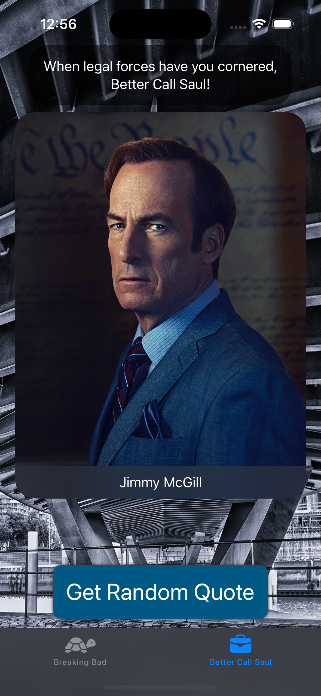

 BB Quotes
 ====
 
 ## Swift 5.5
 Async: it allows us to mark our functions as asynchronous functions and then when we run any asynchronous.
 Await: if we want to run asynchronous functions, we need to put await in front of then, let main thread to wait a while for other threads to finish. Run the thread in the background and be doing your UI stuff and other stuffs on the main thread while you're awaiting for this to be finished.

- Concurrency & Multithreading: Do mo

## ViewModel

### ObservableObject
ObservableObject is a type of object that is designed to be observed by a view. When the data within the ObservableObject changes, it notifies the observing views, prompting them to update/re-render to reflect the new data.

### @MainActor
he @MainActor attribute in Swift is part of the concurrency model introduced in Swift 5.5.

When you apply @MainActor to a class or struct, all methods and properties within that class or struct are implicitly executed on the main thread.
### task
run the asynchrous in synchrous 

## ScreenShot

