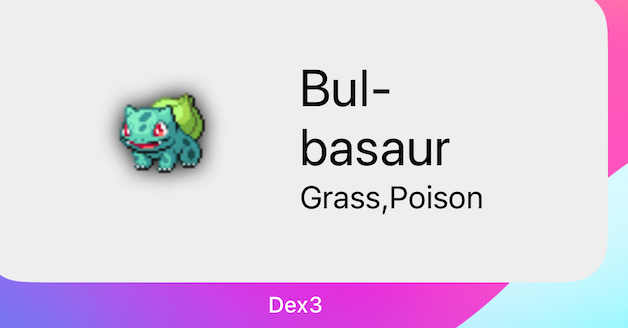
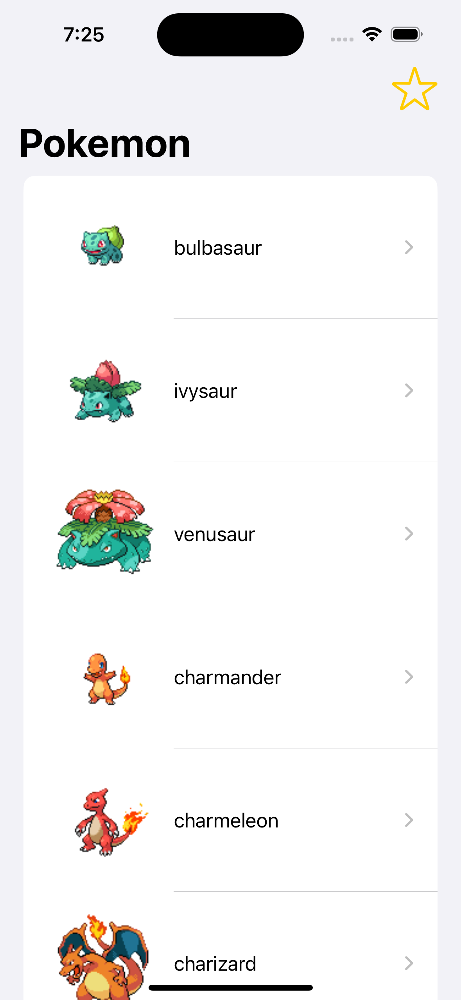
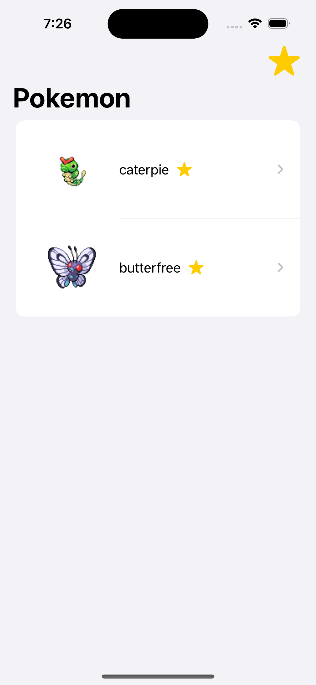
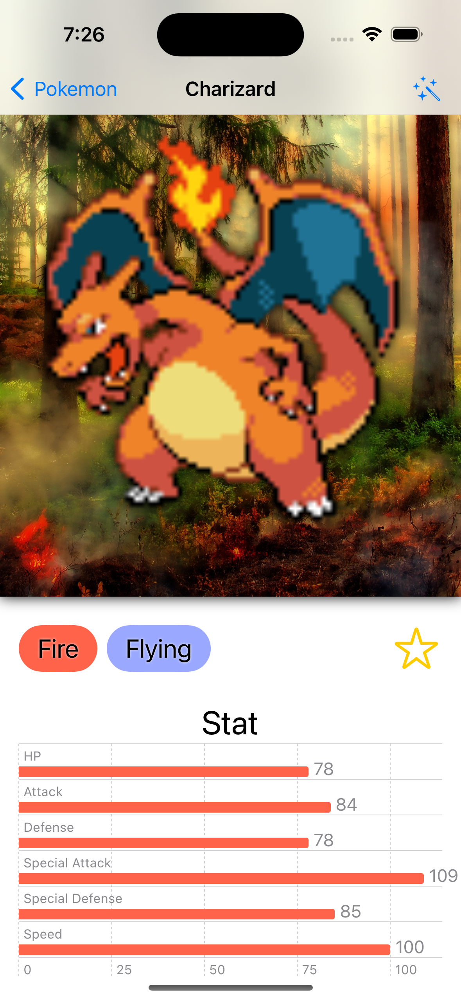
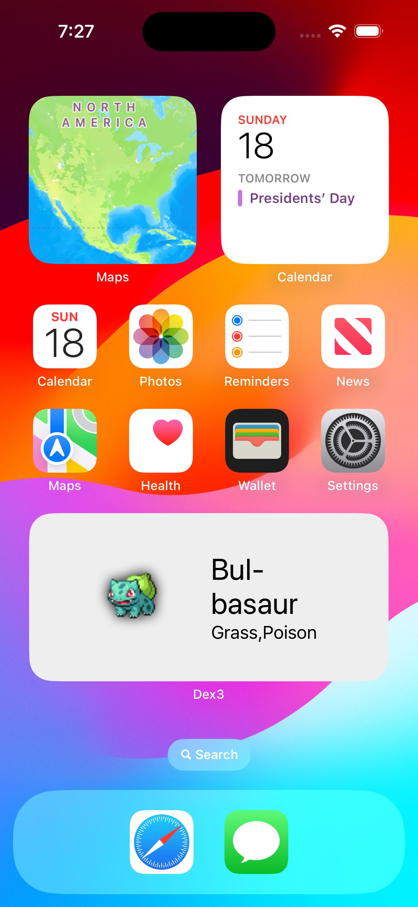

Dex
====

## Widget
The widget screenshot:


## Lanugage 
Use `if let node` to replace `if let node = node` or `if node != nil` 

## Core Data
Setup preview and real data in Persistence file.

- Get specific data via NSPredicate:
```
let fetchRequest: NSFetchRequest<Pokemon> = Pokemon.fetchRequest()
fetchRequest.predicate = NSPredicate(format: "id IN %@", [1, 386])
```

- Share data with widget by setting group and setup it initially:
```
container = NSPersistentContainer(name: "Dex3")
if inMemory {
    container.persistentStoreDescriptions.first!.url = URL(fileURLWithPath: "/dev/null")
} else {
    container.persistentStoreDescriptions.first!.url = FileManager.default.containerURL(forSecurityApplicationGroupIdentifier: "group.com.minyi.Dex3Group")!.appending(path: "Dex3.sqlite")
}
```

## NSSecureUnarchiveFromDataTransformer
Transformable needs to be changed as NSSecureUnarchiveFromDataTransformer in Core Data

## @EnvironmentObject
> The @EnvironmentObject is a property wrapper in SwiftUI, which is a user interface toolkit for the Swift programming language. When you use @EnvironmentObject, you're telling SwiftUI that the view expects to find an object of a particular type in the environment, and that it should use that object to get its data.
 ```
 // Define a class that conforms to ObservableObject with some shared data
class UserData: ObservableObject {
    @Published var username: String = "Guest"
    // ... other shared data
}

// Add an instance of the class to the environment of your SwiftUI view hierarchy
struct ContentView: View {
    var body: some View {
        VStack {
            UsernameView() // This view will access the UserData object from the environment
            // ... other child views
        }
        .environmentObject(UserData())
    }
}

// Access the environment object within a child view
struct UsernameView: View {
    @EnvironmentObject var userData: UserData // Automatically gets UserData from the environment
    
    var body: some View {
        Text("Hello, \(userData.username)!")
    }
}
```

## Json Structure
```
{
  "id": 25,
  "name": "Pikachu",
  "types": [
    {
      "type": {
        "name": "electric"
      }
    }
  ],
  "stats": [
    {
      "base_stat": 35,
      "stat": {
        "name": "hp"
      }
    },
    {
      "base_stat": 55,
      "stat": {
        "name": "attack"
      }
    },
    {
      "base_stat": 40,
      "stat": {
        "name": "defense"
      }
    },
    {
      "base_stat": 50,
      "stat": {
        "name": "special-attack"
      }
    },
    {
      "base_stat": 50,
      "stat": {
        "name": "special-defense"
      }
    },
    {
      "base_stat": 90,
      "stat": {
        "name": "speed"
      }
    }
  ],
  "sprites": {
    "front_sprite": "http://example.com/sprite.png",
    "front_shiny": "http://example.com/shiny.png"
  }
}

``` 


## Screenshot




